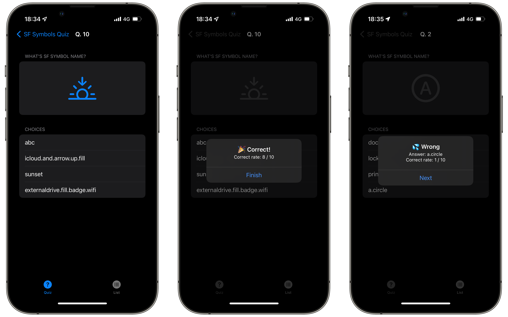
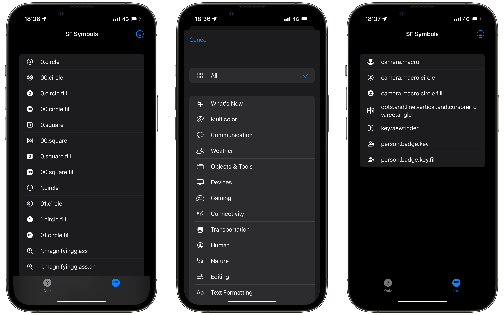

# SF Symbols Quiz

**SF Symbols Quiz** is the 4-choice quiz app in which you answer the names of [SF Symbols](https://developer.apple.com/sf-symbols/). This application supports the symbols included in **SF Symbols 3.3**.

    

In the List tab, you can see a list of symbols that will be used in the quiz.

    

## Requirements

- Xcode 13.3+
- iOS 15.4+
